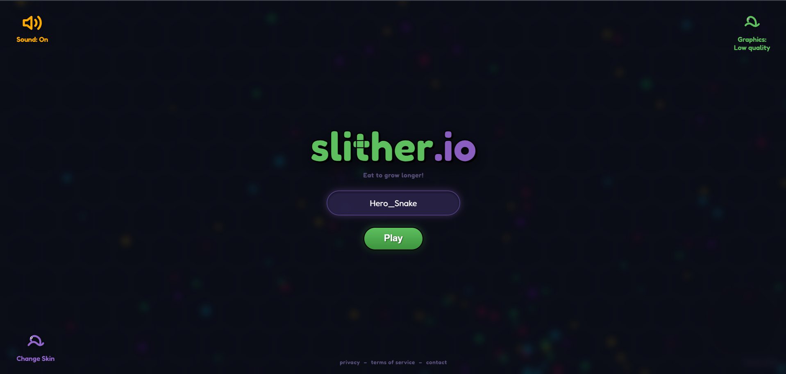
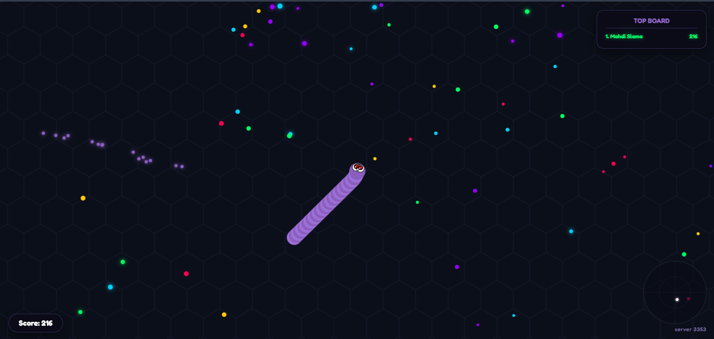
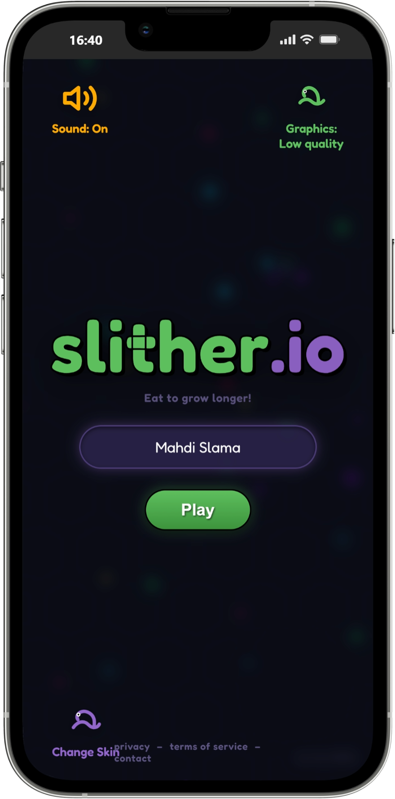
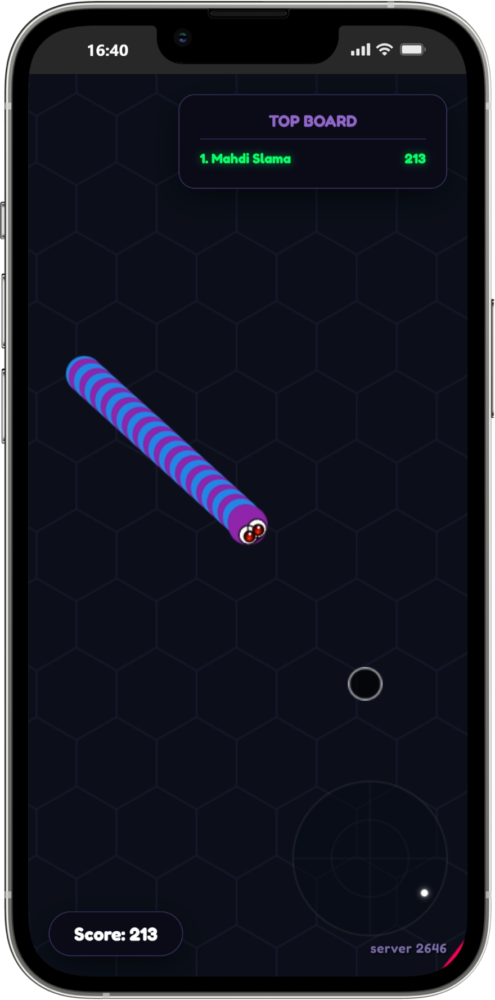

# 🐍 Slither.io Premium Multiplayer Edition

An advanced, high-performance multiplayer Slither.io clone built from scratch using **Node.js, Express, Socket.io**, and pure **HTML5 Canvas** (Vanilla CSS & JavaScript). Featuring custom skin design interfaces, sound effect synthesizers, professional graphics settings, mobile-friendly virtual joystick controllers, and interactive administrative CMD panel loops.

## LapTop ScreenShot


---

## Mobile ScreenShot




## 🌟 Key Features

### 🎮 Premium Gameplay & Mechanics
- **Real-Time Multiplayer Synchronization**: Fully synchronized position and angle updates managed by a server-side physics loop operating at 60 ticks per second.
- **Volumetric 3D Snake Rendering**: Body segments stacked closely using radial gradients and spherical shading, creating a glossy, tube-like volumetric appearance.
- **Overlapping Cartoon Eyes**: Cute cartoon eyes with black borders and white highlights, featuring a **glowing orange-red radial reflection** inside the pupils to match high-fidelity gameplay designs.
- **Twinkling Food Pellets**: Food pellets that dynamically twinkle/pulsate in size when graphics are set to High Quality, with a magnetic pull effect towards the player's head.

### 🎨 Custom Skins Selector & Builder
- **Carousel Selector**: Features 10 pre-configured classic skins (e.g., Purple Slither, Neon Blue-Green, USA Patriotic, Honey Bee, Candy Cane).
- **"Build a Slither" Custom Builder**: A modular modal allowing players to construct their own custom repeating color sequence using a palette of 30+ colors with a live-slithering snake preview.

### 🔊 Pure Web Audio API Synthesizers
- Custom synthesizers built directly into the client script, bypassing any loading lag or asset requirements:
  - **Eat Sound**: Synthesizes a high-pitched frequency sweep up from 450Hz to 950Hz.
  - **Die Sound**: Synthesizes a digital sawtooth explosion sweep down from 280Hz to 40Hz.
  - **Boost Hum**: Modulated low-frequency oscillator (LFO) triangle wave humming at 16Hz for deep engine-acceleration rumble.
  - **Mute Control**: Dedicated sound button on the menu to toggle all sounds between On and Off.

### 📱 Responsive Mobile Controls
- **Virtual Steering Joystick**: Styled glassmorphic joystick base with a black metallic dial and a white glowing border ring.
- **Full-Screen Touch Boosting**: Drag the joystick to steer, and tap/hold **anywhere else** on the screen to activate speed boosting.

### 🔒 Security & Anti-Cheat Guards
- **Name Sanitization**: Nickname values are restricted to a maximum of 15 characters, and HTML tags are stripped on the server to prevent XSS injection.
- **Uniqueness Checker**: Rejects duplicate names among active players, displaying a clean validation message on join failure.
- **Rate-Limiting Protection**: Checks client packet timestamps to restrict incoming steering updates, preventing server flooding attacks.
- **XSS Leaderboard Protection**: Leaderboard nick display uses secure character escaping helpers.

### 🛠️ CMD Administrative Console
An interactive Command-Line Interface (CLI) is active on the server console in real time:
- **Simplified Short IDs**: Players are assigned short numeric IDs starting from `1` (e.g., 1, 2, 3) to easily target them in administrative actions.
- **Real-Time Server Commands**:
  - `list`: Displays a detailed table of online players, showing their Numeric ID, Socket ID, Name, Length, and Score.
  - `ban <id/name/socket>`: Instantly kicks and disconnects a target player using their numeric ID, nickname, or socket string.
  - `feed <id/name/socket> <amount>`: Instantly increases a player's size by the specified length amount.
  - `help`: Lists commands and syntax.

---

## 🚀 Installation & Setup

### Prerequisites
Make sure you have [Node.js](https://nodejs.org/) (version 14.x or higher) installed on your system.

### Steps
1. **Clone or Download the Repository**:
   Extract all files into a directory of your choice.

2. **Install Dependencies**:
   Open a terminal in the project directory and run:
   ```bash
   npm install
   ```

3. **Start the Server**:
   Launch the game server by running:
   ```bash
   npm start
   ```
   *The console will display: `Physics Server Running 🚀` and prompt: `admin-panel>`.*

4. **Play the Game**:
   Open your web browser and navigate to:
   ```http
   http://localhost:4000
   ```

---

## 🔧 Console CLI Commands

Once the server is running, you can type the following commands directly into the terminal console:

### 1. List Active Players
```bash
list
```
**Output Example**:
```text
======================== ACTIVE PLAYERS LIST ========================
ID      SOCKET ID               NAME            LENGTH          SCORE
---------------------------------------------------------------------
1       jB36K64RdWGb-4OaAAAD    Hero_Snake      22.0            219
2       sK21N58WqLKm-9IaAAAF    Neon_Worm       18.4            184
=====================================================================
```

### 2. Feed a Player
```bash
feed <ID_or_Name> <amount>
```
*Example:* `feed 1 50` increases player 1's snake length by 50 units.

### 3. Ban and Kick a Player
```bash
ban <ID_or_Name>
```
*Example:* `ban 1` or `ban Hero_Snake` will immediately disconnect them and redirect them back to the main menu.

### 4. Display Help Menu
```bash
help
```

---

## 🎮 Game Controls

### 💻 Desktop
- **Steer**: Move the mouse cursor around the screen; the snake follows the cursor direction.
- **Boost**: Click and hold the Left Mouse Button or press the Spacebar.
- **Mute Sound**: Click the Sound toggle button in the top-left corner.
- **Adjust Graphics**: Click the Graphics quality button in the top-right corner.

### 📱 Mobile / Tablets
- **Steer**: Drag the circular virtual joystick located in the bottom-left corner of the screen.
- **Boost**: Hold another finger down **anywhere else** on the screen. Lifting the finger stops boosting.

---

## 📂 Project Structure

```text
├── public/                  # Frontend assets
│   ├── index.html           # Main UI layout, modals, HUD, and Canvas
│   ├── script.js            # Game loops, Web Audio synth, renderer, touch listeners
│   └── app.js               # Client helper logic
├── server.js                # Node.js backend physics tick and admin CLI REPL
├── package.json             # Project metadata and dependencies
└── README.md                # Project documentation
```

---

## 📝 License
This project is open-source and free to modify. Enjoy playing and developing! 🎮
